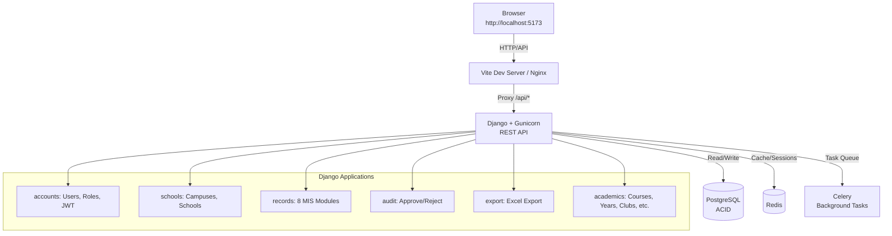
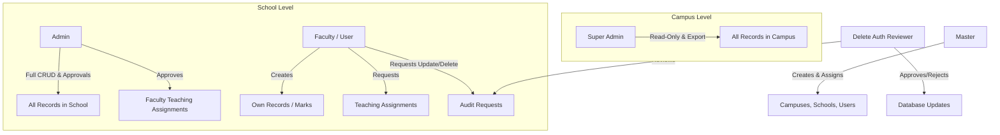
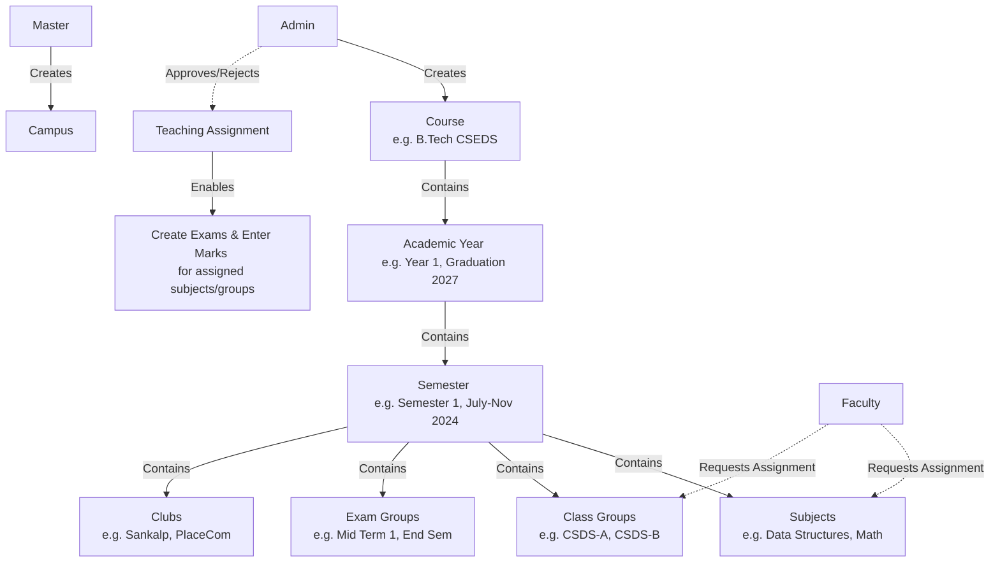
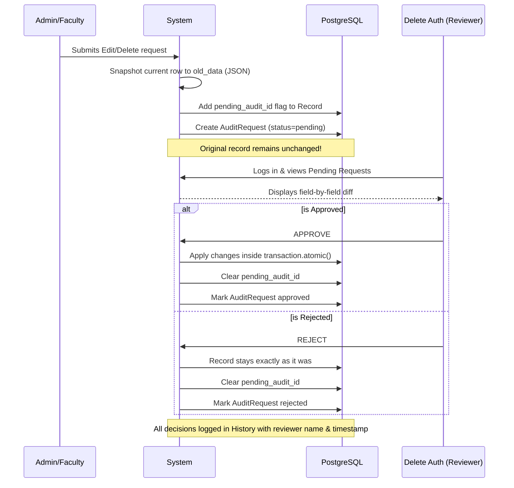
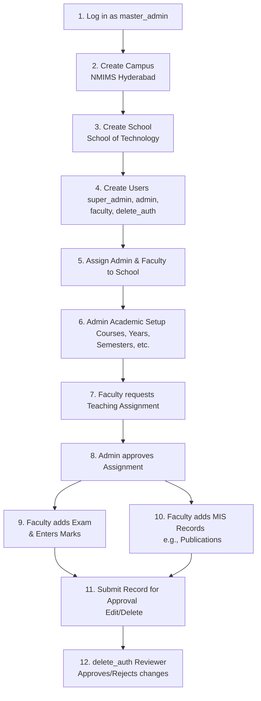
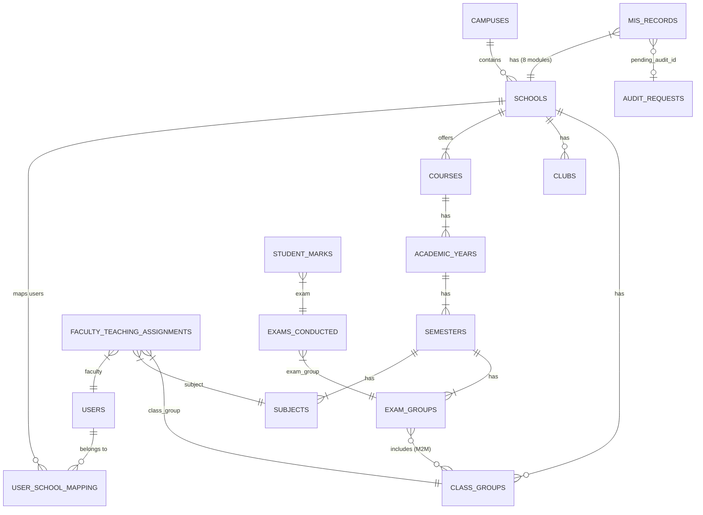

# NMPralekh — MIS Dashboard Portal

A full-stack Management Information System portal built for NMIMS University across all 9 campuses. Manages academic records, faculty activities, student activities, examinations, publications, patents, certifications, and placements — with a complete role-based access control system and an audit-driven change workflow.

---

## Tech Stack

| Layer | Technology |
|---|---|
| Frontend | React 18 + Vite + Tailwind CSS |
| Backend | Django 6 + Django REST Framework |
| Database | PostgreSQL 15+ (ACID compliant) |
| Auth | JWT via djangorestframework-simplejwt + httpOnly cookies |
| Cache | Redis + django-redis |
| Background Tasks | Celery |
| Excel Export | openpyxl |
| Production Server | Gunicorn (gthread workers) |
| Container | Podman |

---

## Architecture Overview



---

## Project Structure

```
nmpralekh/
├── venv/                           # Python virtual environment (never commit)
├── client/                         # React Vite frontend
│   ├── src/
│   │   ├── api/
│   │   │   └── axios.js            # Axios with cookie auth + auto refresh
│   │   ├── context/
│   │   │   └── AuthContext.jsx     # Auth state, login, logout
│   │   ├── components/
│   │   │   ├── layout/
│   │   │   │   ├── Layout.jsx      # Page wrapper with sidebar
│   │   │   │   └── Sidebar.jsx     # Role-aware navigation
│   │   │   ├── ui/
│   │   │   │   ├── Table.jsx       # Sortable paginated table + mobile cards
│   │   │   │   ├── Modal.jsx       # Form modal
│   │   │   │   ├── Button.jsx      # Primary, secondary, danger variants
│   │   │   │   ├── Badge.jsx       # Status pills
│   │   │   │   ├── FormInput.jsx   # Input, select, textarea
│   │   │   │   ├── PageHeader.jsx  # Title + action button
│   │   │   │   ├── EmptyState.jsx  # Empty table placeholder
│   │   │   │   ├── ConfirmDialog.jsx
│   │   │   │   └── MultiPersonPicker.jsx  # Co-authors / co-applicants
│   │   │   └── ProtectedRoute.jsx  # Role-based route guard
│   │   ├── pages/
│   │   │   ├── auth/               # Login, Unauthorized
│   │   │   ├── master/             # Campus, School, User, Assignment mgmt
│   │   │   ├── admin/              # Admin dashboard + all modules
│   │   │   ├── faculty/            # Faculty dashboard + self-managed modules
│   │   │   ├── superadmin/         # Read-only cross-campus view + exports
│   │   │   ├── deleteauth/         # Pending requests + history
│   │   │   ├── records/            # Shared record module pages (8 modules)
│   │   │   └── academics/          # Courses, Years, Semesters, Subjects etc.
│   │   ├── hooks/
│   │   │   ├── useRecords.js       # Generic CRUD + server-side pagination
│   │   │   ├── useSchools.js       # Fetch assigned schools for dropdowns
│   │   │   └── useExport.js        # Excel file download handler
│   │   ├── App.jsx                 # Router + role-based redirects
│   │   └── main.jsx
│   ├── tailwind.config.js
│   ├── vite.config.js              # Proxy /api/* to Django
│   └── package.json
│
├── server/                         # Django backend
│   ├── apps/
│   │   ├── accounts/               # Custom User model, JWT, permissions
│   │   │   ├── models.py           # User with role + campus FK
│   │   │   ├── serializers.py
│   │   │   ├── views.py            # Login, logout, refresh, me, user CRUD
│   │   │   ├── permissions.py      # IsMaster, IsAdmin, IsUser etc.
│   │   │   └── authentication.py  # CookieJWTAuthentication
│   │   ├── schools/                # Campus, School, UserSchoolMapping
│   │   │   ├── models.py
│   │   │   ├── serializers.py
│   │   │   ├── views.py
│   │   │   └── utils.py            # get_user_school_ids (campus-scoped)
│   │   ├── academics/              # Academic structure
│   │   │   ├── models.py           # Course, AcademicYear, Semester,
│   │   │   │                       # Subject, ClassGroup, ExamGroup,
│   │   │   │                       # Club, FacultyTeachingAssignment
│   │   │   ├── serializers.py
│   │   │   └── views.py
│   │   ├── records/                # All 8 MIS data modules
│   │   │   ├── models.py           # ExamsConducted, SchoolActivity,
│   │   │   │                       # StudentActivity, FacultyFDPWorkshopGL,
│   │   │   │                       # FacultyPublication, Patent,
│   │   │   │                       # Certification, PlacementActivity,
│   │   │   │                       # StudentMarks, PublicationAuthor,
│   │   │   │                       # PatentApplicant
│   │   │   ├── serializers.py
│   │   │   ├── views.py            # School-scoped CRUD + audit interception
│   │   │   └── cache_utils.py      # Redis-cached dashboard counts
│   │   ├── audit/                  # Approve/reject workflow
│   │   │   ├── models.py           # AuditRequest
│   │   │   ├── serializers.py
│   │   │   └── views.py            # Pending list, approve, reject, history
│   │   └── export/                 # Excel generation
│   │       ├── views.py            # Per-module + all exports
│   │       └── tasks.py            # Celery async export tasks
│   ├── config/
│   │   ├── settings.py
│   │   ├── urls.py
│   │   ├── wsgi.py
│   │   ├── celery.py
│   │   └── pagination.py           # StandardPagination (25/page)
│   ├── gunicorn.conf.py            # Production server config
│   ├── entrypoint.sh               # Podman startup script
│   ├── manage.py
│   ├── requirements.txt
│   └── .env                        # Never commit — see .env.example
│
├── start.sh                        # Start all services in one command
├── server.sh                       # Start Django only
├── client.sh                       # Start React only
├── celery.sh                       # Start Celery only
└── README.md
```

---

## User Roles and Hierarchy



| Action | master | super_admin | admin | faculty | delete_auth |
|---|---|---|---|---|---|
| Create campuses | ✅ | ❌ | ❌ | ❌ | ❌ |
| Create schools | ✅ | ❌ | ❌ | ❌ | ❌ |
| Create users | ✅ | ❌ | ❌ | ❌ | ❌ |
| Assign users to schools | ✅ | ❌ | ❌ | ❌ | ❌ |
| View all campus records | ❌ | ✅ | ❌ | ❌ | ❌ |
| View own school records | ❌ | ✅ | ✅ | ✅ | ❌ |
| Create records | ❌ | ❌ | ✅ | ✅ | ❌ |
| Request update/delete | ❌ | ❌ | ✅ | ✅ | ❌ |
| Approve/reject changes | ❌ | ❌ | ❌ | ❌ | ✅ |
| Approve faculty assignments | ❌ | ❌ | ✅ | ❌ | ❌ |
| Export Excel | ❌ | ✅ | ✅ | ✅ | ❌ |
| Enter student marks | ❌ | ❌ | ✅ | ✅ | ❌ |

---

## MIS Record Modules

| Module | Key Fields |
|---|---|
| Exams Conducted | Exam group, subject, class group, faculty, date |
| School Activities | Name, date, details, school-wide flag, collaborating schools |
| Student Activities | Name, date, details, club/committee dropdown, collaborations |
| Faculty FDP/Workshop/GL | Faculty, date range, name, type, organizing body |
| Faculty Publications | Author(s), title, journal/conference, date, venue, DOI |
| Patents | Applicant(s), title, date, journal number, status |
| Certifications | Name, date, course title, agency, Credly link |
| Placement Activities | Name, date, details, PlaceCom, company |
| Student Marks | Student name, roll number, marks, max marks, absent flag |

---

## Academic Structure Flow



---

## Audit and Delete Auth Flow

Every **UPDATE** and **DELETE** goes through a strict approval workflow:



---

## Prerequisites

```
Python 3.11+
Node.js 18+
PostgreSQL 15+
Redis 6+
Git
```

---

## Initial Setup

### 1. Clone and enter the project

```bash
git clone <your-repo-url>
cd nmpralekh
```

### 2. Create virtual environment

```bash
python -m venv venv
source venv/bin/activate
```

### 3. Install Python dependencies

```bash
cd server
pip install -r requirements.txt
```

### 4. Set up PostgreSQL

```sql
CREATE DATABASE nmpralekh
    ENCODING 'UTF8'
    LC_COLLATE 'en_US.UTF-8'
    LC_CTYPE 'en_US.UTF-8'
    TEMPLATE template0;

CREATE USER mis_user WITH PASSWORD 'your_strong_password';

ALTER ROLE mis_user SET client_encoding TO 'utf8';
ALTER ROLE mis_user SET default_transaction_isolation TO 'read committed';
ALTER ROLE mis_user SET timezone TO 'Asia/Kolkata';

GRANT ALL PRIVILEGES ON DATABASE nmpralekh TO mis_user;

-- PostgreSQL 15+ also requires this
\c nmpralekh
GRANT ALL ON SCHEMA public TO mis_user;

\q
```

### 5. Configure environment variables

Create `server/.env`:

```ini
SECRET_KEY=your_long_random_secret_key
DEBUG=True
ALLOWED_HOSTS=localhost,127.0.0.1

DB_NAME=nmpralekh
DB_USER=mis_user
DB_PASSWORD=your_strong_password
DB_HOST=127.0.0.1
DB_PORT=5432

JWT_ACCESS_MINUTES=30
JWT_REFRESH_DAYS=7

TIME_ZONE=Asia/Kolkata

CORS_ALLOWED_ORIGINS=http://localhost:5173

REDIS_URL=redis://127.0.0.1:6379/1
```

Generate a secure secret key:

```bash
python -c "from django.core.management.utils import get_random_secret_key; print(get_random_secret_key())"
```

### 6. Run migrations

```bash
python manage.py makemigrations accounts
python manage.py makemigrations schools
python manage.py makemigrations audit
python manage.py makemigrations records
python manage.py makemigrations academics
python manage.py migrate
```

### 7. Create the master user

```bash
python manage.py createsuperuser
```

Enter username, email and password when prompted. This account gets the `master` role automatically.

### 8. Install frontend dependencies

```bash
cd ../client
npm install
```

---

## Database Optimization (pgBouncer)

For production-grade connection pooling, it is highly recommended to use **pgBouncer**.

### Step 1 — Install pgBouncer
```bash
sudo apt update
sudo apt install pgbouncer -y
```
Verify installation:
```bash
pgbouncer --version
```

### Step 2 — Configure pgBouncer
Open the config file:
```bash
sudo nano /etc/pgbouncer/pgbouncer.ini
```
Replace the entire content with:
```ini
[databases]
nmpralekh = host=127.0.0.1 port=5432 dbname=nmpralekh

[pgbouncer]
listen_port          = 6432
listen_addr          = 127.0.0.1
auth_type            = md5
auth_file            = /etc/pgbouncer/userlist.txt

pool_mode            = transaction
max_client_conn      = 200
default_pool_size    = 20
reserve_pool_size    = 5
reserve_pool_timeout = 5

log_connections      = 0
log_disconnections   = 0
log_pooler_errors    = 1

server_reset_query   = DISCARD ALL
ignore_startup_parameters = extra_float_digits

admin_users = pgbouncer
stats_users = pgbouncer
```

### Step 3 — Create pgBouncer User File
pgBouncer needs its own user authentication file. First get the MD5 hash of your password:
```bash
echo -n "your_strong_passwordmis_user" | md5sum
```
Copy the hash it outputs. Then open the userlist file:
```bash
sudo nano /etc/pgbouncer/userlist.txt
```

Add this line using your hash:
```
"mis_user" "md5YOURHASHHERE"
```

For example if your hash was `abc123`:
```
"mis_user" "md5abc123"
"pgbouncer" "admin"
```

### Step 4 — Start pgBouncer
```bash
sudo systemctl start pgbouncer
sudo systemctl enable pgbouncer
sudo systemctl status pgbouncer
```
Should show `active (running)`.

### Step 5 — Test pgBouncer Connection
```bash
psql -U mis_user -d nmpralekh -h 127.0.0.1 -p 6432
```
If it connects successfully type `\q` to exit.

### Step 6 — Update Django to Use pgBouncer Port
Open `server/.env` and change the port from `5432` to `6432`:
```ini
DB_NAME=nmpralekh
DB_USER=mis_user
DB_PASSWORD=your_strong_password
DB_HOST=127.0.0.1
DB_PORT=6432
```

---

## Running Locally

### Option A — Single command

```bash
cd ~/nmpralekh
chmod +x start.sh
./start.sh
```

Starts Redis, Django, Celery, and React with clean Ctrl+C shutdown.

### Option B — Separate terminals

**Terminal 1 — Redis**
```bash
sudo systemctl start redis
```

**Terminal 2 — Django**
```bash
cd ~/nmpralekh
source venv/bin/activate
cd server
python manage.py runserver
```

**Terminal 3 — Celery**
```bash
cd ~/nmpralekh/server
source ~/nmpralekh/venv/bin/activate
celery -A config worker --loglevel=info --concurrency=4
```

**Terminal 4 — React**
```bash
cd ~/nmpralekh/client
npm run dev
```

Open `http://localhost:5173` in your browser.

---

## First Use Flow



---

## API Reference

### Authentication
```
POST   /api/auth/login/        → Returns user object, sets httpOnly cookies
POST   /api/auth/refresh/      → Refreshes access token cookie
POST   /api/auth/logout/       → Blacklists token, clears cookies
GET    /api/auth/me/           → Current user profile
```

### Users (master only)
```
GET    /api/users/
POST   /api/users/
PUT    /api/users/<id>/
DELETE /api/users/<id>/
```

### Campuses (master only)
```
GET    /api/schools/campuses/
POST   /api/schools/campuses/
PUT    /api/schools/campuses/<id>/
DELETE /api/schools/campuses/<id>/
GET    /api/schools/campuses/<id>/schools/
GET    /api/schools/campuses/<id>/users/
```

### Schools
```
GET    /api/schools/
POST   /api/schools/
PUT    /api/schools/<id>/
POST   /api/schools/assign/
DELETE /api/schools/assign/<id>/
GET    /api/schools/my-schools/
GET    /api/schools/faculty/
```

### Academics
```
GET/POST   /api/academics/courses/
GET/POST   /api/academics/years/
GET/POST   /api/academics/semesters/
GET/POST   /api/academics/subjects/
GET/POST   /api/academics/class-groups/
GET/POST   /api/academics/exam-groups/
GET/POST   /api/academics/clubs/
GET/POST   /api/academics/assignments/
POST       /api/academics/assignments/<id>/approve/
POST       /api/academics/assignments/<id>/reject/
GET        /api/academics/my-assignments/
GET        /api/academics/faculty/
```

### Records (scoped to user's school)
```
GET/POST       /api/records/exams/
PUT/DELETE     /api/records/exams/<id>/       → Creates audit request

GET/POST       /api/records/school-activities/
GET/POST       /api/records/student-activities/
GET/POST       /api/records/fdp/
GET/POST       /api/records/publications/
GET/POST       /api/records/patents/
GET/POST       /api/records/certifications/
GET/POST       /api/records/placements/
GET/POST       /api/records/marks/

GET/POST       /api/records/publications/<id>/authors/
GET/POST       /api/records/patents/<id>/applicants/
GET            /api/records/dashboard-counts/
```

### Audit
```
GET    /api/audit/
GET    /api/audit/<id>/
POST   /api/audit/<id>/approve/
POST   /api/audit/<id>/reject/
GET    /api/audit/history/
```

### Export
```
GET    /api/export/exams/
GET    /api/export/school-activities/
GET    /api/export/student-activities/
GET    /api/export/fdp/
GET    /api/export/publications/
GET    /api/export/patents/
GET    /api/export/certifications/
GET    /api/export/placements/
GET    /api/export/all/

GET    /api/export/academics/courses/
GET    /api/export/academics/years/
GET    /api/export/academics/semesters/
GET    /api/export/academics/subjects/
GET    /api/export/academics/class-groups/
GET    /api/export/academics/exam-groups/
GET    /api/export/academics/clubs/
GET    /api/export/academics/marks/
GET    /api/export/academics/all/
```

### Common Query Parameters
```
?school_id=1
?campus_id=1
?date_from=2024-01-01
?date_to=2024-12-31
?page=1
?page_size=25
?status=pending
?type=FDP
?author_type=faculty
?is_active=true
```

---

## Database Schema



All record tables share this pattern:
```
school_id        → data isolation per school
created_by       → audit trail
created_at       → immutable timestamp
updated_at       → auto-updated on every save
is_deleted       → soft delete flag
pending_audit_id → FK to pending change request
```

---

## Performance

```
Concurrent users     →  500 (dev) / 1500+ (Gunicorn 9 workers)
Response time        →  <50ms cached / <150ms uncached
Dashboard loads      →  <5ms (Redis cached 60 seconds)
Export row limit     →  5000 rows per file
Pagination           →  25 records per page server-side
DB indexes           →  On school, date, created_by, status columns
Connection pooling   →  CONN_MAX_AGE = 0 (Managed by pgBouncer)
Rate limiting        →  20/min anonymous, 200/min authenticated
```

---

## Security

```
Authentication   →  JWT in httpOnly SameSite=Lax cookies (XSS safe)
Token refresh    →  Automatic via Axios interceptor on 401
Token rotation   →  Refresh tokens rotate on every use
Token blacklist  →  Logout blacklists token in database
Data isolation   →  Every query scoped to user's school and campus
Soft deletes     →  Records never hard deleted without approval
Audit trail      →  Every change logged with who, when, what
Password hashing →  Django PBKDF2 with SHA256
CORS             →  Restricted to configured origins only
SQL injection    →  Django ORM parameterised queries throughout
Strict SQL mode  →  STRICT_TRANS_TABLES enforced on connection
```

---

## Production Deployment (Podman)

```bash
podman-compose up -d
podman-compose exec backend python manage.py migrate
podman-compose exec backend python manage.py createsuperuser
```

Services:
- `db` — PostgreSQL with persistent named volume
- `backend` — Django + Gunicorn, runs migrate on startup
- `frontend` — Nginx serving Vite production build, proxies /api to backend
- `redis` — Cache and Celery broker
- `celery` — Background worker for exports

---

## Important Rules

- Never commit `.env`, `settings.py`, or `wsgi.py`
- Never gitignore `migrations/` — they must be committed
- All record edits and deletes go through audit — nothing is directly modified
- Faculty only see and manage their own publications, patents, certifications
- Super admins are strictly read-only
- Master is the only role that creates campuses, schools, and users
- Faculty teaching assignments must be admin-approved before exam creation