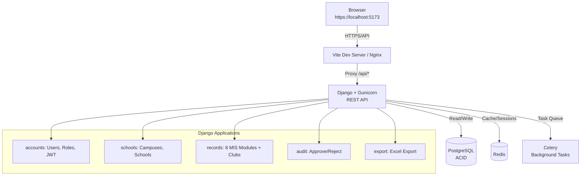
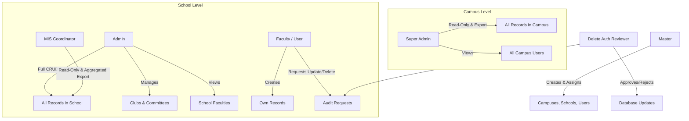
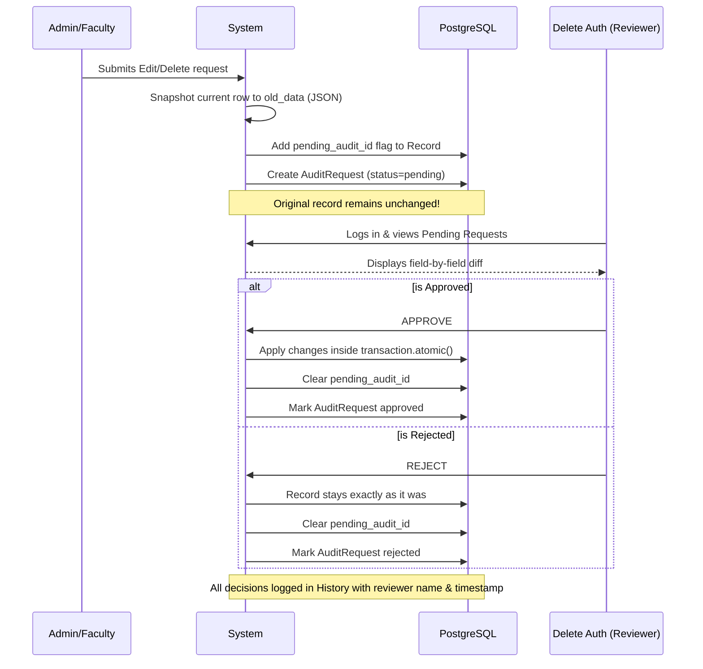
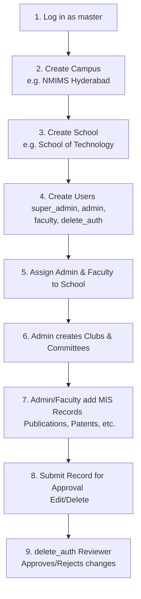
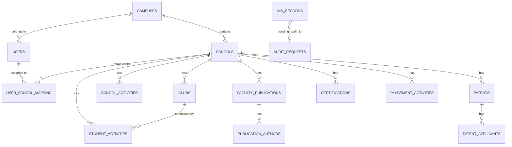

# NMPralekh — MIS Dashboard Portal

A full-stack Management Information System portal built for NMIMS University across all 9 campuses. Manages faculty activities, student activities, publications, patents, certifications, and placements — with a complete role-based access control system and an audit-driven change workflow.

---

## Tech Stack

| Layer | Technology |
|---|---|
| Frontend | React 18 + Vite + Tailwind CSS |
| Backend | Django 6 + Django REST Framework |
| Database | PostgreSQL 15+ (ACID compliant) |
| Auth | JWT via djangorestframework-simplejwt + httpOnly cookies |
| Cache | Redis + django-redis |
| Background Tasks | Celery |
| Search & Filtering | django-filter + DRF SearchFilter |
| Excel Export | openpyxl |
| Production Server | Gunicorn (gthread workers) |

---

## Architecture Overview



---

## Project Structure

```
nmpralekh/
├── venv/                           # Python virtual environment (never commit)
├── client/                         # React Vite frontend
│   ├── src/
│   │   ├── api/
│   │   │   └── axios.js            # Axios with cookie auth + auto refresh
│   │   ├── context/
│   │   │   └── AuthContext.jsx     # Auth state, login, logout
│   │   ├── components/
│   │   │   ├── layout/
│   │   │   │   ├── Layout.jsx      # Page wrapper with sidebar
│   │   │   │   └── Sidebar.jsx     # Role-aware navigation
│   │   │   ├── ui/
│   │   │   │   ├── Table.jsx       # Sortable paginated table + mobile cards
│   │   │   │   ├── Modal.jsx       # Form modal
│   │   │   │   ├── Button.jsx      # Primary, secondary, danger variants
│   │   │   │   ├── Badge.jsx       # Status pills
│   │   │   │   ├── FormInput.jsx   # Input, searchable select, textarea
│   │   │   │   ├── SearchableSelect.jsx # Custom combobox with filtering
│   │   │   │   ├── PageHeader.jsx  # Title + action button
│   │   │   │   ├── EmptyState.jsx  # Empty table placeholder
│   │   │   │   ├── ConfirmDialog.jsx
│   │   │   │   └── MultiPersonPicker.jsx  # Co-authors / co-applicants
│   │   │   └── ProtectedRoute.jsx  # Role-based route guard
│   │   ├── pages/
│   │   │   ├── auth/               # Login, Unauthorized
│   │   │   ├── master/             # Campus, School, User, Assignment mgmt
│   │   │   ├── admin/              # Admin dashboard, Clubs, Faculties view
│   │   │   ├── faculty/            # Faculty dashboard + self-managed modules
│   │   │   ├── superadmin/         # Read-only view, Campus Users, exports
│   │   │   ├── deleteauth/         # Pending requests + history
│   │   │   └── records/            # Shared record module pages (7 modules)
│   │   ├── hooks/
│   │   │   ├── useRecords.js       # Generic CRUD + server-side pagination
│   │   │   ├── useSchools.js       # Fetch assigned schools for dropdowns
│   │   │   └── useExport.js        # Excel file download handler
│   │   ├── App.jsx                 # Router + role-based redirects
│   │   └── main.jsx
│   ├── tailwind.config.js
│   ├── vite.config.js              # HTTPS + Proxy /api/* to Django
│   └── package.json
│
├── server/                         # Django backend
│   ├── apps/
│   │   ├── accounts/               # Custom User model, JWT, permissions
│   │   │   ├── models.py           # User with role + campus FK
│   │   │   ├── serializers.py      # UserSerializer, UserVisibilitySerializer
│   │   │   ├── views.py            # Login, logout, refresh, me, user CRUD,
│   │   │   │                       # SchoolFacultiesView, CampusUsersView
│   │   │   ├── permissions.py      # IsMaster, IsAdmin, IsSuperAdmin, IsUser
│   │   │   └── authentication.py   # CookieJWTAuthentication
│   │   ├── schools/                # Campus, School, UserSchoolMapping
│   │   │   ├── models.py
│   │   │   ├── serializers.py
│   │   │   ├── views.py
│   │   │   └── utils.py            # get_user_school_ids (campus-scoped)
│   │   ├── records/                # All MIS data modules + Clubs
│   │   │   ├── models.py           # Club, SchoolActivity, StudentActivity,
│   │   │   │                       # FacultyFDPWorkshopGL, FacultyPublication,
│   │   │   │                       # Patent, Certification, PlacementActivity,
│   │   │   │                       # PublicationAuthor, PatentApplicant,
│   │   │   │                       # BackupConfiguration
│   │   │   ├── serializers.py
│   │   │   ├── views.py            # School-scoped CRUD + audit interception
│   │   │   └── cache_utils.py      # Redis-cached dashboard counts
│   │   ├── audit/                  # Approve/reject workflow
│   │   │   ├── models.py           # AuditRequest
│   │   │   ├── serializers.py
│   │   │   └── views.py            # Pending list, approve, reject, history
│   │   └── export/                 # Excel generation
│   │       ├── views.py            # Per-module + all exports
│   │       └── tasks.py            # Celery async export tasks
│   ├── config/
│   │   ├── settings.py
│   │   ├── settings.example.py     # Template — copy to settings.py, fill secrets
│   │   ├── urls.py
│   │   ├── wsgi.py
│   │   ├── wsgi.example.py         # Template — includes deployment notes
│   │   ├── celery.py
│   │   └── pagination.py           # StandardPagination (25/page)
│   ├── gunicorn.conf.py            # Production server config (gthread, 9w × 2t)
│   ├── manage.py
│   ├── requirements.txt
│   └── .env                        # Never commit — use .env.example as reference
│
├── start.sh                        # Start all services in one command (Gunicorn)
├── server.sh                       # Start Gunicorn only
├── client.sh                       # Start React only
├── celery.sh                       # Start Celery only
└── README.md
```

---

## User Roles and Hierarchy



| Action | master | super_admin | admin | faculty | delete_auth | mis_coordinator |
|---|---|---|---|---|---|---|
| Create campuses | ✅ | ❌ | ❌ | ❌ | ❌ | ❌ |
| Create schools | ✅ | ❌ | ❌ | ❌ | ❌ | ❌ |
| Create users | ✅ | ❌ | ❌ | ❌ | ❌ | ❌ |
| Assign users to schools | ✅ | ❌ | ❌ | ❌ | ❌ | ❌ |
| View all campus records | ❌ | ✅ | ❌ | ❌ | ❌ | ❌ |
| View campus users | ❌ | ✅ | ❌ | ❌ | ❌ | ❌ |
| View school faculties | ❌ | ❌ | ✅ | ❌ | ❌ | ❌ |
| Manage clubs & committees | ❌ | ❌ | ✅ | ❌ | ❌ | ❌ |
| View own school records | ❌ | ✅ | ✅ | ✅ | ❌ | ✅ |
| Create records | ❌ | ❌ | ✅ | ✅ | ❌ | ❌ |
| Request update/delete | ❌ | ❌ | ✅ | ✅ | ❌ | ❌ |
| Approve/reject changes | ❌ | ❌ | ❌ | ❌ | ✅ | ❌ |
| Export Excel | ❌ | ✅ | ✅ | ✅ | ❌ | ✅ |

---

## MIS Record Modules

| Module | Key Fields |
|---|---|
| School Activities | Name, date, details, school-wide flag, collaborating schools |
| Student Activities | Name, date, details, club/committee dropdown, collaborations |
| Faculty FDP/Workshop/GL | Faculty, date range, name, type, organizing body |
| Faculty Publications | Author(s), title, journal/conference, date, venue, DOI/Link (required) |
| Patents | Applicant(s), title, date, journal number, status, DOI/Link (required) |
| Certifications | Name, date, course title, agency, Credly/Proof link (required) |
| Placement Activities | Name, date, details, PlaceCom, company |

### Clubs & Committees

Clubs are managed by Admins and linked to schools. They come in three types:
- **Club** — Student clubs (e.g. Coding Club, IEEE)
- **Committee** — Faculty/student committees
- **Placement Committee** — PlaceCom entities

When creating Student Activities, users select from registered clubs via a searchable dropdown, with an "Other" option for free-text entry.

---

## Audit and Delete Auth Flow

Every **UPDATE** and **DELETE** goes through a strict approval workflow:



---

## Prerequisites

```
Python 3.11+
Node.js 18+
PostgreSQL 15+
Redis 6+
Git
```

---

## Initial Setup

### 1. Clone and enter the project

```bash
git clone <your-repo-url>
cd nmpralekh
```

### 2. Create virtual environment

```bash
python -m venv venv
source venv/bin/activate
```

### 3. Install Python dependencies

```bash
cd server
pip install -r requirements.txt
```

### 4. Set up PostgreSQL

```sql
CREATE DATABASE nmpralekh
    ENCODING 'UTF8'
    LC_COLLATE 'en_US.UTF-8'
    LC_CTYPE 'en_US.UTF-8'
    TEMPLATE template0;

CREATE USER mis_user WITH PASSWORD 'your_strong_password';

ALTER ROLE mis_user SET client_encoding TO 'utf8';
ALTER ROLE mis_user SET default_transaction_isolation TO 'read committed';
ALTER ROLE mis_user SET timezone TO 'Asia/Kolkata';

GRANT ALL PRIVILEGES ON DATABASE nmpralekh TO mis_user;

-- PostgreSQL 15+ also requires this
\c nmpralekh
GRANT ALL ON SCHEMA public TO mis_user;

\q
```

### 5. Configure environment variables

Create `server/.env`:

```ini
SECRET_KEY=your_long_random_secret_key
DEBUG=True
ALLOWED_HOSTS=localhost,127.0.0.1

DB_NAME=nmpralekh
DB_USER=mis_user
DB_PASSWORD=your_strong_password
DB_HOST=127.0.0.1
DB_PORT=5432

JWT_ACCESS_MINUTES=30
JWT_REFRESH_DAYS=7

TIME_ZONE=Asia/Kolkata

CORS_ALLOWED_ORIGINS=https://localhost:5173

REDIS_URL=redis://127.0.0.1:6379/1
```

Generate a secure secret key:

```bash
python -c "from django.core.management.utils import get_random_secret_key; print(get_random_secret_key())"
```

### 6. Run migrations

```bash
python manage.py makemigrations accounts schools audit records export
python manage.py migrate
```

### 7. Create the master user

```bash
python manage.py createsuperuser
```

Enter username, email and password when prompted. This account gets the `master` role automatically.

### 8. Install frontend dependencies

```bash
cd ../client
npm install
```

---

## Database Optimization (pgBouncer)

For production-grade connection pooling, it is highly recommended to use **pgBouncer**.

### Step 1 — Install pgBouncer
```bash
sudo apt update
sudo apt install pgbouncer -y

```

Verify installation:

```bash
pgbouncer --version

```

### Step 2 — Configure pgBouncer

Open the config file:

```bash
sudo nano /etc/pgbouncer/pgbouncer.ini

```

Replace the entire content with:

```ini
[databases]
nmpralekh = host=127.0.0.1 port=5432 dbname=nmpralekh

[pgbouncer]
listen_port          = 6432
listen_addr          = 127.0.0.1
auth_type            = scram-sha-256
auth_file            = /etc/pgbouncer/userlist.txt

pool_mode            = transaction
max_client_conn      = 200
default_pool_size    = 20
reserve_pool_size    = 5
reserve_pool_timeout = 5

# Timeouts to prevent idle connections and bottlenecks
server_idle_timeout  = 600
client_idle_timeout  = 300
query_wait_timeout   = 30

log_connections      = 0
log_disconnections   = 0
log_pooler_errors    = 1

# In transaction mode, server_reset_query is ignored anyway
# but DISCARD ALL is expensive if it were used.
server_reset_query   = DISCARD ALL
ignore_startup_parameters = extra_float_digits

admin_users = pgbouncer
stats_users = pgbouncer

```

### Step 3 — Generate SCRAM-SHA-256 Passwords

pgBouncer needs its own user authentication file with secure SCRAM hashes generated by PostgreSQL.

Log into PostgreSQL as the postgres administrator:

```bash
sudo -u postgres psql

```

Run the following SQL commands to generate the hashes:

```sql
-- Ensure PostgreSQL uses SCRAM encryption
SET password_encryption = 'scram-sha-256';

-- Update your main database user to generate the hash
ALTER USER mis_user WITH PASSWORD 'your_strong_password';

-- Create the internal pgbouncer admin user
CREATE USER pgbouncer WITH PASSWORD 'admin';

-- Extract the generated hashes to copy
SELECT rolname, rolpassword FROM pg_authid WHERE rolname IN ('mis_user', 'pgbouncer');

```

Copy the long strings that start with `SCRAM-SHA-256$4096:...` and type `\q` to exit.

### Step 4 — Create pgBouncer User File

Open the userlist file:

```bash
sudo nano /etc/pgbouncer/userlist.txt

```

Add the users using the hashes you just copied (keep the double quotes):

```text
"mis_user" "SCRAM-SHA-256$4096:..."
"pgbouncer" "SCRAM-SHA-256$4096:..."

```

### Step 5 — Start pgBouncer

```bash
sudo systemctl restart pgbouncer
sudo systemctl enable pgbouncer
sudo systemctl status pgbouncer

```

Should show `active (running)`.

### Step 6 — Test pgBouncer Connection

```bash
psql -U mis_user -d nmpralekh -h 127.0.0.1 -p 6432

```

If it connects successfully type `\q` to exit.

### Step 7 — Update Django to Use pgBouncer Port

Open `server/.env` and change the port from `5432` to `6432`:

```ini
DB_PORT=6432

```


## Redis Configuration (Optimization & Limits)

To prevent Redis from growing unbounded and to ensure it can handle a high volume of concurrent users (e.g., 10,000+), you must configure strict memory caps, an eviction policy, and connection limits.

### Step 1 — Edit redis.conf

Open the Redis configuration file:
```bash
sudo nano /etc/redis/redis.conf
```

**1a. Set Memory Limits:**
Search for the `# maxmemory <bytes>` section and add (or uncomment):

```conf
maxmemory 256mb
maxmemory-policy allkeys-lru
```

*(This limits Redis to 256 MB of RAM. Once full, it evicts the least recently used keys.)*

**1b. Set Connection Limits:**
Search for the `# maxclients 10000` section and update it to allow a safe buffer for web workers and Celery:

```conf
maxclients 20000
```

### Step 2 — Increase System File Descriptor Limits

Linux limits the number of file descriptors (network connections) a service can open. To allow Redis to actually accept 20,000 clients, you must increase this limit at the system level.

Open the Redis service override file:

```bash
sudo systemctl edit redis
```

Add the following lines at the **very top** of the file (do not use a `#` at the beginning):

```ini
[Service]
LimitNOFILE=65536
```

Save and exit the editor.

### Step 3 — Apply the changes

Reload the systemd daemon to recognize the new file limit, then restart Redis to apply all configurations:

```bash
sudo systemctl daemon-reload
sudo systemctl restart redis
```

*(Optional) If you only want to apply the memory limits live without a restart, you can use:*

```bash
redis-cli CONFIG SET maxmemory 256mb
redis-cli CONFIG SET maxmemory-policy allkeys-lru
# Note: maxclients and LimitNOFILE require a restart to take effect safely.
```


---

## Gunicorn Configuration

The project uses **Gunicorn** with `gthread` workers as its production WSGI server. The config lives in `server/gunicorn.conf.py`.

### Why WSGI / Gunicorn and not ASGI / Uvicorn?

The entire codebase is synchronous Django — every view, ORM call, and Celery task uses sync code. ASGI would run those sync views inside a thread pool anyway, adding overhead with no benefit. Move to ASGI only if you add Django Channels (WebSockets) or rewrite critical views as `async def`.

### Thread math and pgBouncer

```
workers  = (CPU cores × 2) + 1   →  9 on a 4-core machine
threads  = 2                      →  lowered from 8 (was exhausting the pool)
─────────────────────────────────────────────────────
total DB connections = 9 × 2 = 18  ←  fits inside pgBouncer's pool of 20
```

> **Why not 8 threads?** 9 workers × 8 threads = 72 concurrent DB connections against a pgBouncer pool capped at 20 → connection exhaustion under load.

### Key settings

| Setting | Value | Reason |
|---|---|---|
| `worker_class` | `gthread` | Thread-based — good for I/O-bound Django |
| `threads` | `2` | Keeps total connections ≤ pgBouncer pool |
| `timeout` | `120` | Covers slow Excel export generation |
| `max_requests` | `1000` | Recycles workers to prevent memory leaks |
| `max_requests_jitter` | `100` | Staggers restarts to avoid thundering-herd |
| `worker_tmp_dir` | `/dev/shm` | RAM-based tmp — faster heartbeat checks |
| `preload_app` | `True` | Forks after import — faster startup, less RAM |
| `graceful_timeout` | `30` | Lets in-flight requests finish on shutdown |
| `limit_request_line` | `4096` | Rejects oversized request lines |
| `limit_request_fields`| `100` | Caps HTTP header count |

---

## Running Locally

### Option A — Single command

```bash
cd ~/nmpralekh
chmod +x start.sh
./start.sh
```

Starts Redis, pgBouncer, Django, Celery, and React with clean Ctrl+C shutdown.

### Option B — Separate terminals

**Terminal 1 — Services**
```bash
sudo systemctl start redis
sudo systemctl start pgbouncer
```

**Terminal 2 — Backend (Gunicorn)**
```bash
cd ~/nmpralekh
source venv/bin/activate
cd server
gunicorn -c gunicorn.conf.py config.wsgi:application
```

> **Development note:** If you need Django's auto-reload while working on the backend, you can still use `python manage.py runserver` locally. Use Gunicorn for any staging or production-like testing.

**Terminal 3 — Celery**
```bash
cd ~/nmpralekh/server
source ~/nmpralekh/venv/bin/activate
celery -A config worker --loglevel=info --concurrency=4
```

**Terminal 4 — React**
```bash
cd ~/nmpralekh/client
npm run dev
```

Open `https://localhost:5173` in your browser.

---

## First Use Flow



---

## API Reference

### Authentication
```
POST   /api/auth/login/        → Returns user object, sets httpOnly cookies
POST   /api/auth/refresh/      → Refreshes access token cookie
POST   /api/auth/logout/       → Blacklists token, clears cookies
GET    /api/auth/me/           → Current user profile
```

### Users (master only)
```
GET    /api/users/
POST   /api/users/
PUT    /api/users/<id>/
DELETE /api/users/<id>/
```

### User Visibility
```
GET    /api/users/school-faculties/  → Admin: faculty in their school(s)
GET    /api/users/campus-users/      → Super Admin: all users in campus
```
Both endpoints support `?search=`, `?role=`, `?school_code=`, and server-side pagination.

### Campuses (master only)
```
GET    /api/schools/campuses/
POST   /api/schools/campuses/
PUT    /api/schools/campuses/<id>/
DELETE /api/schools/campuses/<id>/
GET    /api/schools/campuses/<id>/schools/
GET    /api/schools/campuses/<id>/users/
```

### Schools
```
GET    /api/schools/
POST   /api/schools/
PUT    /api/schools/<id>/
POST   /api/schools/assign/
DELETE /api/schools/assign/<id>/
GET    /api/schools/my-schools/
GET    /api/schools/faculty/
```

### Clubs & Committees
```
GET    /api/records/clubs/              → List (admin + faculty)
POST   /api/records/clubs/              → Create (admin only)
PUT    /api/records/clubs/<id>/         → Update (admin only)
DELETE /api/records/clubs/<id>/         → Delete (admin only)
```
Supports `?school=`, `?type=`, `?is_active=` query params.

### Records (scoped to user's school)
```
GET/POST       /api/records/school-activities/
GET/POST       /api/records/student-activities/
GET/POST       /api/records/fdp/
GET/POST       /api/records/publications/
GET/POST       /api/records/patents/
GET/POST       /api/records/certifications/
GET/POST       /api/records/placements/

GET/POST       /api/records/publications/<id>/authors/
GET/POST       /api/records/patents/<id>/applicants/
GET            /api/records/dashboard-counts/
```

### Audit
```
GET    /api/audit/
GET    /api/audit/<id>/
POST   /api/audit/<id>/approve/
POST   /api/audit/<id>/reject/
GET    /api/audit/history/
```

### Export
```
GET    /api/export/school-activities/
GET    /api/export/student-activities/
GET    /api/export/fdp/
GET    /api/export/publications/
GET    /api/export/patents/
GET    /api/export/certifications/
GET    /api/export/placements/
GET    /api/export/coordinator/         → MIS Coordinator aggregated multi-format export
GET    /api/export/all/
```

### Common Query Parameters
```
?school_id=1
?campus_id=1
?date_from=2024-01-01
?date_to=2024-12-31
?page=1
?page_size=25
?search=keyword
?status=pending
?type=FDP
?author_type=faculty
?is_active=true
?school_code=SOT
```

---

## Database Schema



All record tables share this pattern:
```
school_id        → data isolation per school
created_by       → audit trail
created_at       → immutable timestamp
updated_at       → auto-updated on every save
pending_audit_id → FK to pending change request
```

---

## Performance

```
Concurrent users     →  500 (dev) / 1500+ (Gunicorn 9 workers × 2 threads)
Response time        →  <50ms cached / <150ms uncached
Dashboard loads      →  <5ms (Redis cached 60 seconds)
Export row limit     →  5000 rows per file
Pagination           →  25 records per page server-side
DB indexes           →  On school, date, created_by, status columns
Connection pooling   →  CONN_MAX_AGE = 0 (pgBouncer transaction mode)
                        9 workers × 2 threads = 18 connections (pool cap: 20)
Rate limiting        →  60/min anonymous, 300/min authenticated
```

---

## Load Testing (Locust)

The project ships with a Locust test script at `server/locustfile.py` that simulates realistic multi-role traffic against the API.

### Install Locust

Locust is **not** in `requirements.txt` (it is a dev-only tool). Install it separately inside the virtualenv:

```bash
source venv/bin/activate
pip install locust
```

### Set up tokens

The script authenticates each virtual user by injecting a pre-captured JWT into the `access_token` cookie. Before running, replace the placeholder values at the top of `server/locustfile.py` with real tokens captured from your browser (DevTools → Application → Cookies):

```python
TOKENS = {
    "master":          "MASTER_JWT_TOKEN",
    "super_admin":     "SUPER_ADMIN_JWT_TOKEN",
    "admin":           "ADMIN_JWT_TOKEN",
    "faculty":         "FACULTY_JWT_TOKEN",
    "delete_auth":     "DELETE_AUTH_JWT_TOKEN",
    "mis_coordinator": "MIS_COORDINATOR_JWT_TOKEN",
}
```

### User classes and weights

| Class | Weight | Role simulated | Endpoints hit |
|---|---|---|---|
| `MasterUser` | 1 | master | `/api/schools/campuses/`, `/api/schools/`, `/api/users/` |
| `SuperAdminUser` | 10 | super_admin | `/api/records/dashboard-counts/`, `/api/users/campus-users/`, `/api/export/all/` |
| `AdminUser` | 15 | admin | `/api/records/dashboard-counts/`, `/api/records/clubs/`, `/api/users/school-faculties/` |
| `FacultyUser` | 60 | faculty | `/api/records/publications/`, `/api/records/patents/`, `/api/records/certifications/` |
| `DeleteAuthUser` | 5 | delete_auth | `/api/audit/`, `/api/audit/history/` |
| `MISCoordinatorUser` | 10 | mis_coordinator | `/api/export/coordinator/` |

Weights reflect realistic traffic: faculty make up ~60 % of users. `wait_time = between(600, 1800)` (10–30 min) simulates actual human think time.

### Running the tests

**Option A — via helper script (recommended)**

```bash
cd ~/nmpralekh
chmod +x locust.sh
./locust.sh
```

Then open the Locust UI at **http://localhost:8089** and configure user count and spawn rate.

**Option B — manual**

```bash
source venv/bin/activate
cd server
locust -f locustfile.py --host=http://127.0.0.1:8000
```

**Option C — headless (CI/scripted runs)**

```bash
locust -f locustfile.py \
  --host=http://127.0.0.1:8000 \
  --headless \
  --users 500 \
  --spawn-rate 10 \
  --run-time 5m
```

### Interpreting results

| Metric | Healthy target |
|---|---|
| Median response time | < 150 ms |
| 95th percentile | < 500 ms |
| Failure rate | < 1 % |
| Gunicorn worker CPU | < 80 % sustained |

> **Note:** The test script disables SSL verification (`urllib3.disable_warnings`) because the dev server uses a self-signed certificate via `django-sslserver`. Remove that line when testing against a properly signed staging environment.

---

## Security

```
Authentication   →  JWT in httpOnly SameSite=Lax cookies (XSS safe)
Token refresh    →  Automatic via Axios interceptor on 401
Token rotation   →  Refresh tokens rotate on every use
Token blacklist  →  Logout blacklists token in database
Data isolation   →  Every query scoped to user's school and campus
Soft deletes     →  Records never hard deleted without approval
Audit trail      →  Every change logged with who, when, what
Password hashing →  Django PBKDF2 with SHA256
CORS             →  Restricted to configured origins only
SQL injection    →  Django ORM parameterised queries throughout
```

---

## Important Rules

- Never commit `.env` or sensitive configuration files
- Never gitignore `migrations/` — they must be committed
- All record edits and deletes go through audit — nothing is directly modified
- Faculty only see and manage their own publications, patents, certifications
- Super admins are strictly read-only
- Master is the only role that creates campuses, schools, and users
- DOI/Link fields are mandatory for Publications, Patents, and Certifications
- All dropdown menus use the searchable `SearchableSelect` component